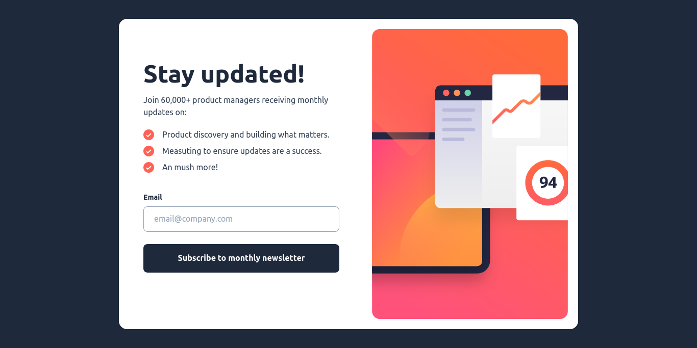
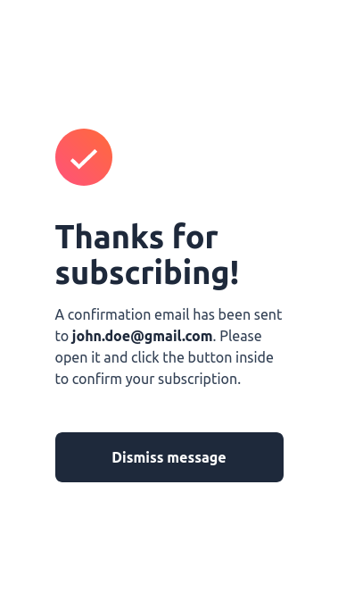

# Frontend Mentor - Newsletter sign-up form with success message solution

This is a solution to the [Newsletter sign-up form with success message challenge on Frontend Mentor](https://www.frontendmentor.io/challenges/newsletter-signup-form-with-success-message-3FC1AZbNrv). Frontend Mentor challenges help you improve your coding skills by building realistic projects.

## Table of contents

- [Overview](#overview)
  - [The challenge](#the-challenge)
  - [Screenshot](#screenshot)
  - [Links](#links)
- [My process](#my-process)
  - [Built with](#built-with)
  - [What I learned](#what-i-learned)
  - [Continued development](#continued-development)
  - [Useful resources](#useful-resources)
- [Author](#author)
- [Acknowledgments](#acknowledgments)

## Overview

### The challenge

Users should be able to:

- Add their email and submit the form
- See a success message with their email after successfully submitting the form
- See form validation messages if:
  - The field is left empty
  - The email address is not formatted correctly
- View the optimal layout for the interface depending on their device's screen size
- See hover and focus states for all interactive elements on the page

### Screenshot

<p align="center">
  
</p>

<p align="center">
  
</p>

### Links

- Solution URL: [Github Repository : FM-newsletter](https://github.com/Lio-n/FM-newsletter)
- Live Site URL: [Vercel](https://fm-newsletter-nine.vercel.app)

## My process

### Built with

- Semantic HTML5 markup
- CSS custom properties
- Flexbox
- Mobile-first workflow
- Typescript
- Atomic Design
- [React](https://reactjs.org/) - JS library
- [Vite](https://vitejs.dev/)
- [Tailwind](tailwindcss.com/) - For styles

### What I learned

In Tailwind CSS, you can set the width, maximum width, and minimum width of an element using utility classes.

```tsx
<div class="w-full max-w-[22rem] min-w-[18rem]">
  <!-- Your content goes here -->
</div>

/*
  - w-full sets the width to 100%.
  - max-w-[22rem] sets the maximum width to 22rem.
  - min-w-[18rem] sets the minimum width to 18rem.

*/
```

### Continued development

I need to improve with Tailwind and Atomic Design.

### Useful resources

- [Atomic Design](https://www.designsystems.com/building-chimekit-with-atomic-design-and-a-collaborative-process/)
- [How to update the Context value in a Provider from the Consumer?](https://stackoverflow.com/questions/50502664/how-to-update-the-context-value-in-a-provider-from-the-consumer)

## Author

- Website - [Portfolio](https://www.leonardofontan.tech/)
- Frontend Mentor - [@Lio-n](https://www.frontendmentor.io/profile/Lio-n)
